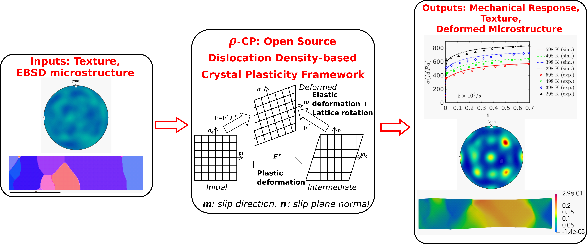

# &rho;-CP: Open Source Dislocation Density Based Crystal Plasticity Framework for Simulating Temperature- and Strain Rate-Dependent Deformation
### Anirban Patra1*, Suketa Chaudhary1, Namit Pai1, Tarakram Ramgopal1, Sarthak Khandelwal1, Adwitiya Rao1, David L. McDowell2,3**
#### 1Department of Metallurgical Engineering and Materials Science, Indian Institute of Technology Bombay, Mumbai, India
#### 2School of Materials Science and Engineering, Georgia Institute of Technology, Atlanta, USA
#### 3GWW School of Mechanical Engineering, Georgia Institute of Technology, Atlanta, USA
#### *anirbanpatra@iitb.ac.in; anirbanpatra@gmail.com
#### **david.mcdowell@me.gatech.edu

&rho;-CP is a crystal plasticity solver that interfaces with the open source finite element solver, MOOSE (https://github.com/idaholab/moose), for crystal plasticity finite element modeling of anisotropic, heterogeneous deformation in polycrystalline ensembles. Source codes for the dislocation density-based crystal plasticity solver are provided in this repository, along with example applications for the thermo-mechanical deformation of hcp magnesium single and polycrystals, polycrystalline fcc OFHC copper and polycrystalline bcc tantalum.

Details of the constitutive model and numerical implementation are available at:  
https://doi.org/10.1016/j.commatsci.2023.112182  
https://arxiv.org/abs/2303.02441

Details of the material properties/model parameters and their input to the model are given in: <a href="rhoCP_model_parameters.pdf" target="_blank">Model Parameters</a>

Details of pre- and post-processing are given in: <a href="rho-CP_Pre_and_Post_Processing.pdf" target="_blank">Pre- and Post-Processing</a>

All input files tested with MOOSE version: 024e31760a (2024-08-13), PETSc version: 3.21.4, SLEPc version: 3.21.1

## Installation
The user needs to install MOOSE first (https://mooseframework.inl.gov/getting_started/installation/index.html), then clone and compile &rho;-CP alongside MOOSE in the `projects` directory:
- Following installation of MOOSE and the required `conda` environment, the source files can be obtained either using the following commands from the `home` directory:   
`cd projects`  
`git clone https://github.com/apatra6/rhocp.git`  
or directly downloading the repository from github in the `projects` directory.
- The executable can be compiled using:  
`cd rhocp`  
`make -j 4`  
to get the executable `rhocp-opt` (here 4 represents the number of processors used for compiling and can be modified appropriately).
- If the user wishes to perform code developement and debug the application using `gdb`, the executable should be compiled in `debug` mode using the following coomand:  
`METHOD=dbg make -j 4`  
to get the executable `rhocp-dbg` (more details can be found at: https://mooseframework.inl.gov/application_development/debugging.html).

## Running Simulations
- The user is suggested to first go through the basics of running MOOSE simulations (https://mooseframework.inl.gov/getting_started/examples_and_tutorials/index.html).
- Example simulation files for magnesium, copper, tantalum, 304L stainless steel, and DX54 ferritic steel  are located in the `examples` directory.
- The following input files are required to run a &rho;-CP simulation: (a) MOOSE input file, with `.i` extension, (b) slip system information file (`bcc_slip_sys.in`, for example), (c) material properties file (`bcc_props.in`, for example), (d) grain orientations in the form of Bunge Euler angles (`orientations.in`, for example). Additionally, the mesh may be: (i) created in the MOOSE input file itself, (ii) imported from an Exodus file (`64grains_512elements.e`, for example), or (iii) imported from an EBSD mesh file (`tantalum_input_original_euler.txt` in `examples/tantalum/EBSD_simulation`, for example). For the last case, Euler angles need not be imported separately.
- The EBSD mesh file can be created using DREAM3D. See: https://mooseframework.inl.gov/source/userobjects/EBSDReader.html and http://www.dream3d.io/2_Tutorials/EBSDReconstruction/ for additional details.
- Simulations can be run using the following example command:  
`mpiexec -n 4 ~/projects/rhocp/rhocp-opt -i Cu_compression_sim.i`  
for running the example given in  `rhocp/examples/copper/strain_rate_effect/compression_sr_1e-1ps/`.
- Output files in the form of `.csv` files can be used for plotting averaged values of various quantities and Exodus `.e` files can be visualized using Paraview (https://www.paraview.org/) for the deformation contours (the user is advised to use Paraview version 5.9 or lower).
- Spatio-temporal data can also be extracted from the `.e` output files using the Python SEACAS (https://github.com/sandialabs/seacas) libraries (an example script `extract_data.py` is provided in `examples/tantalum/temperature_effect/compression_512/298K_sr_5000_512grains`) or using the GUI-based data extraction tools in Paraview.

## References
For the general &rho;-CP framework, refer to:
- Patra, A., Chaudhary, S., Pai, N., Ramgopal, T., Khandelwal, S., Rao, A., McDowell, D.L., “&rho;-CP: Open source dislocation density based crystal plasticity framework for simulating temperature- and strain rate-dependent deformation”, Computational Materials Science, Vol. 224, 2023, 112182.

For prediction of residual strains during post-solidification cooling (see: examples/304steel_cooling_residual_stress) and calculation of lattice strains, refer to:
- Pokharel, R., Patra, A., Brown, D.W., Clausen, B., Vogel, S.C., Gray, G.T., “An analysis of phase stresses in additively manufactured 304L stainless steel using neutron diffraction measurements and crystal plasticity finite element simulations”, International Journal of Plasticity, Vol. 121, 2019, pp. 201-217.

For prediction of the deformation behavior of DX54 ferritic steel using the visco-plastic dislocation density based model, refer to:
- Patra, A., Tomé, C.N., “A dislocation density-based crystal plasticity constitutive model: Comparison of VPSC effective medium predictions with ρ-CP finite element predictions”, Modelling and Simulation in Materials Science and Engineering, Vol. 32, 2024, 045014.

For the dislocation density-based J2 plasticity model, refer to: 
- Ellis, B.D., Haider, H., Priddy, M.W., Patra, A., “Integrated computational design of three-phase Mo-Si-B alloy turbine blade for high-temperature aerospace applications”, Integrating Materials and Manufacturing Innovation, Vol. 10, 2021, pp. 245-264. 
- Khandelwal, S., Basu, S., Patra, A., “A machine learning-based surrogate modeling framework for predicting the history-dependent deformation of dual phase microstructures”, Materials Today Communications, Vol. 29, 2021, 102914. 
- Basu, S., Patra, A., Jaya, B.N., Ganguly, S., Dutta, M., Samajdar, I., “Study of microstructure - property correlations in dual phase steels for achieving enhanced strength and reduced strain partitioning”, Materialia, Vol. 25, 2022, 101522. 

Numerical integration of the J2 plasticity model can be inferred from: 
- Patra, A., Pai, N., Sharma, P., “Modeling intrinsic size effects using dislocation density-based strain gradient plasticity”, Mechanics Research Communications, Vol. 127, 2023, 104038.
